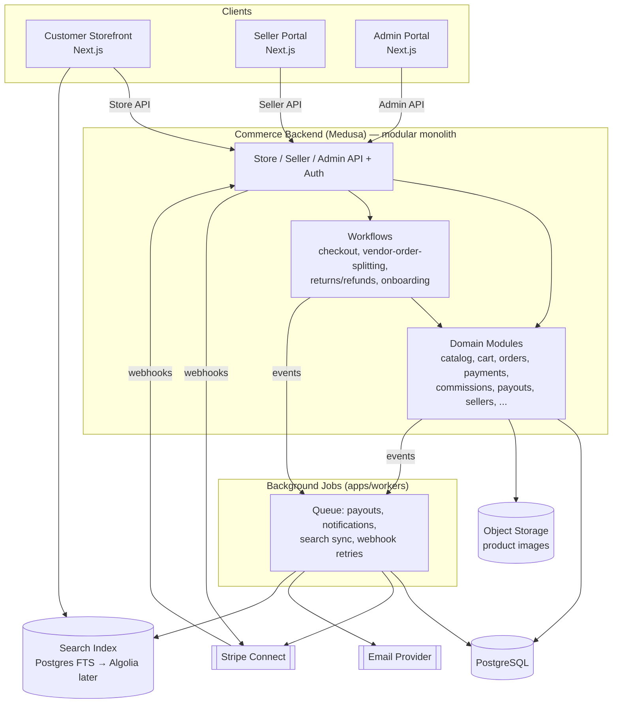

# Bawi Shopping — Architecture

## 1. Principles

- **Modular monolith first.** One deployable backend service (Medusa), internally organized into isolated modules with explicit boundaries and their own tables. No microservices, no separate databases per domain, no network hop between modules.
- **Apps are thin clients.** The storefront, seller portal, and admin portal contain presentation and light request-shaping logic only. All business rules, validation, and state transitions live in the Medusa backend (modules + workflows), reachable only through its APIs.
- **Vendor scoping is structural, not incidental.** Every seller-owned table carries `vendor_id`, and every module's service layer enforces that scope internally — callers cannot opt out of it by forgetting a `WHERE` clause.
- **Boring technology.** Prefer Medusa's and Next.js's built-in capabilities over adding libraries. Every new dependency must justify itself against "can the framework already do this."

## 2. Applications

Five deployables, one repo:

| App | Responsibility | Notes |
|---|---|---|
| **Customer storefront** (`apps/storefront`) | Browsing, search, cart, checkout, order tracking, reviews | Next.js, public-facing, SEO-relevant (SSR/ISR for product/category pages). **Built:** customer registration, public product detail page (`/products/:code`), fashion-focused homepage, category browse pages (`/categories/:handle`), search/filter/sort page (`/search`), mobile filter drawer, i18n foundation (language selector, six locales). |
| **Seller portal** (`apps/seller-portal`) | Public seller-application intake, account activation, seller onboarding, catalog/inventory/pricing management, order fulfillment, shipping, returns handling, payouts, reporting | Next.js, mixed public (`/apply`, `/apply/:id`, `/activate`) and authenticated (seller-actor session) pages. **Built:** seller login, seller-application submission/status, account activation, product list/create/edit/preview/image-upload/submit-for-review (category picker now reflects the admin-managed parent/child tree). |
| **Admin portal** (`apps/admin`) | Seller application review/approval/rejection, moderation, commission configuration, platform reporting, audit log review | Next.js, authenticated, admin-actor session (Medusa's native `user` actor type). Built as a full Next.js app on the same shared design system, not a Medusa Admin Extension — see [`DECISIONS.md`](DECISIONS.md) for why. **Built:** login, seller-application list/detail/approve/reject, product-listing list/detail/approve/reject, category management (create/edit/delete, parent/child, translations). |
| **Commerce backend** (`apps/backend`) | Medusa instance: all modules, workflows, REST/Store/Admin APIs, webhook receivers | Node/TypeScript, the only app with direct DB access. **Built:** `seller`, `seller-application`, `audit-log`, `product-listing`, `category-translation` custom modules, layered on Medusa's native product/variant/inventory/pricing/file/product-category modules; public `/categories`, `/products` (search/filter/sort/pagination), `/brands` routes. |
| **Background jobs** (`apps/workers`) | Scheduled jobs and queue consumers: payouts, search index sync, notification delivery, webhook retry, reporting rollups | Separate Node process from the API, shares the module layer as a library, scales independently. **Not yet built.** |

*A dedicated courier-facing client is undecided — it may be a thin scoped view (e.g. within `apps/admin` or its own minimal page set) rather than a sixth full app, given how narrow the courier role's access is (see [`USER-ROLES.md`](USER-ROLES.md) §2.7). Not designed yet; noted here so a future session doesn't assume a full app is required by default.*

Each frontend calls the commerce backend only through its published API surface (Store API for storefront, a seller-scoped/public API namespace for the seller portal, Admin API for the admin portal). No frontend talks to PostgreSQL directly.

## 3. System diagram



## 4. Module map

Medusa v2 ships a set of native commerce modules; the marketplace-specific concepts (sellers, commissions, payouts, vendor-order splitting, moderation, audit logs) do not exist natively and are built as first-class custom Medusa modules following the same module conventions (own tables, own service, own migrations, linked to core modules via Medusa's module-link system rather than foreign keys reaching across module boundaries).

| Required domain | Implementation | Notes |
|---|---|---|
| Authentication | Native Medusa `auth` module | Extended with three actor types: `customer` (native), `seller_user` (custom — see below), `user` (native, admin) |
| Customers | Native Medusa `customer` module | Unmodified |
| Sellers | **Custom module: `seller`** (implemented) | Root of vendor scoping; owns `vendor_id`. `Seller` + `SellerUser` models (name, slug, status, role) plus Stripe Connect onboarding status (`stripe_account_id`, `stripe_charges_enabled`, `stripe_payouts_enabled`, `stripe_details_submitted`, `public_brand_display_approved`) — see [`DECISIONS.md`](DECISIONS.md). Never stores bank details, identity documents, tax IDs, or the full Stripe account object — only the opaque account-id reference and status booleans derived from webhooks. |
| Business configuration | **Custom module: `business-config`** (implemented) | Category/key/value store for commission rate, transfer-hold period, return window, seller prep deadline, shipping fee, service area, and similar business inputs, plus the launch-safety feature flags (`live_payments_enabled`, `real_transfers_enabled`, etc., all default `false`). Every write is audit-logged. See [`DECISIONS.md`](DECISIONS.md). |
| Seller onboarding | **Custom module: `seller-application`** (implemented, application intake/review/approval + activation) **+ future Stripe Connect linking** | Split in two: `seller-application` owns `SellerApplication` (draft/submitted/under_review/approved/rejected/withdrawn) and is separate from `seller`'s approved records by design (see [`DECISIONS.md`](DECISIONS.md)); approval creates the `Seller`/`SellerUser` and an activation token. Stripe Connect account linking (originally planned as part of this domain) is still a future slice, layered on after activation. |
| Catalog | Native Medusa `product` module (as catalog container) | — |
| Categories | Native Medusa `product-category` module (implemented) + **custom module: `category-translation`** (implemented) | Platform-owned taxonomy, fully admin-editable including parent/child nesting - native `product_category.parent_category_id` already supports arbitrary-depth trees, so no custom category-structure module was needed, only translations. `category_translation` is a separate table keyed by `category_id` + `locale` (five non-English locales only - English is the native category's own `name`), same "translation table, never per-locale columns" convention as the deferred `product_translation` table. Admin category CRUD runs through Medusa's native `createProductCategoriesWorkflow`/`updateProductCategoriesWorkflow`/`deleteProductCategoriesWorkflow`, composed alongside translation writes and the audit log in this project's own `create-category`/`update-category`/`delete-category` workflows (same saga pattern as `approve-product-listing.ts`). Deletion is refused (409) while a category still has child categories or products assigned; moving a category under itself or one of its own descendants is refused (422) via an explicit ancestor-chain walk (`wouldCreateCycle`). |
| Products & variants | Native Medusa `product` module (implemented) + **custom module: `product-listing`** (implemented) | Vendor ownership is **not** a module-link - `product-listing` is a separate table with a plain `product_id` reference to the native product (same loose-coupling reasoning as `seller-application`'s reference to `seller`, see [`DECISIONS.md`](DECISIONS.md)). It also owns the marketplace approval status (`draft/pending_review/approved/rejected/archived`, distinct from native `product.status`) and the permanent `product_code`. Native option/variant creation already rejects duplicate color/size combinations - no custom validation needed for that. |
| Inventory | Native Medusa `inventory` module (implemented) | One shared "Bawi Fulfillment Center" stock location for v1 (not per-seller yet - a deliberate simplification, see [`DECISIONS.md`](DECISIONS.md)); scoped indirectly via the owning product's `product_listing.vendor_id`, not a native column |
| Pricing | Native Medusa `pricing` module (implemented) | Integer USD minor units; scoped indirectly the same way as inventory |
| Image storage | Native Medusa `file` module (implemented, local provider) | Local dev adapter now; swap to the `file-s3` provider for production - no code change needed, config only |
| Search | `packages/search-contract` (interface) + `apps/backend/src/search` (v1 adapter, implemented) | Interface/adapter pattern; a live-query Postgres adapter now, Algolia (or ranked Postgres FTS) adapter later - see §6 |
| Cart | Native Medusa `cart` module (implemented) + custom validation layer (`apps/backend/src/cart/`) | Persistence unmodified - holds multi-seller line items. Custom `/store/cart/*` routes (not Medusa's native `/store/carts`) re-resolve price/inventory/approval status server-side on every add/read via `resolveCartVariant()`; vendor ownership lives only in line-item `metadata.vendor_id`, never a response field. Guest identity is Medusa's own cart id, forwarded as an `x-cart-id` header from a storefront-owned cookie (not a cookie the backend sets) - same pattern as the customer session token. See [`DECISIONS.md`](DECISIONS.md). |
| Checkout | **Custom workflow, not a module**: `checkout` orchestration | Composes cart, pricing, inventory, payment, vendor-order-splitting |
| Payments | Native Medusa `payment` module + **custom Stripe Connect payment provider** | Bawi Shopping is merchant of record for every transaction (resolved — see [`DECISIONS.md`](DECISIONS.md)); Separate Charges and Transfers, never Destination Charges. See [`PAYMENTS.md`](PAYMENTS.md) |
| Commissions | **Custom module: `commission`** | Rate resolution (reads from `business-config`) + ledger |
| Payouts | **Custom module: `payout`** | Stripe Transfer orchestration, run from `apps/workers` |
| Orders | Native Medusa `order` module | Represents the customer-facing order group |
| Vendor-order splitting | **Custom module: `vendor-order`** + splitting workflow | One `vendor_order` per seller per order |
| Shipping | Native Medusa `fulfillment` module | Seller-scoped shipping options/providers |
| Returns | Native Medusa `order` return workflows | Extended for per-vendor-order scope |
| Refunds | Native Medusa `payment` module refund flow | Extended to trigger commission reversal |
| Reviews | **Custom module: `review`** | Verified-purchase gated |
| Moderation | **Custom module: `moderation`** | Polymorphic queue over products/reviews |
| Notifications | Native Medusa `notification` module | Email provider + templates, dedup log |
| Reporting | **Custom module: `reporting`** | Read-side aggregation over existing modules, no owned source-of-truth data |
| Audit logs | **Custom module: `audit-log`** (implemented) | Append-by-convention today (no application code path issues UPDATE/DELETE against it); a single `record()` method on the module service, called directly by mutating routes rather than via an event subscriber for now — see [`SECURITY.md`](SECURITY.md) §6 |
| Private fulfillment | **Custom module: `fulfillment-privacy`** *(decided, not yet built)* | Separate temporary fulfillment/pickup/tracking codes per order (pickup codes single-use, expire on collection); Bawi-mediated communication/tracking/returns/packaging; the `courier` actor type/role lives here, scoped to its one assigned delivery. Designed so pickup location is resolvable per order (direct vendor pickup or a future Bawi sorting hub), never hard-coded to one model. See [`DECISIONS.md`](DECISIONS.md), [`PRD.md`](PRD.md) §9.23, [`SECURITY.md`](SECURITY.md) §11. |
| Localization | **Custom module: `localization`/`translation`** *(decided, not yet built)* | Six-language support (English fallback), product translations stored in their own table keyed by `product_id` + `locale`, Bawi approval required before a translation is customer-visible. See [`PRD.md`](PRD.md) §9.24. |

Custom modules communicate with native modules exclusively through Medusa's module-link and workflow/event-subscriber mechanisms — never direct cross-module table joins — preserving the modular-monolith boundary so any module could theoretically be extracted into its own service later without a rewrite.

### 4.1 The `seller_user` actor type (implemented)

Medusa v2's `auth` module is actor-type-agnostic: `/auth/:actor_type/:auth_provider/*` works for any actor type string without separate registration. `seller_user` needs no auth-module config beyond what's already there — the actual work is:

1. A `seller_user` row is created in the custom `seller` module, linked to a freshly-created `auth_identity` by id.
2. That `auth_identity`'s `app_metadata.seller_user_id` is set to the `SellerUser` row's id (`authModuleService.updateAuthIdentities(...)`).
3. Medusa's own JWT issuance then sets the token's `actor_id` claim to that same id — so an authenticated request's `req.auth_context.actor_id` *is* the `SellerUser.id`, resolved entirely server-side.
4. Routes under `/seller/*` are protected by `authenticate("seller_user", ["bearer", "session"])` in `apps/backend/src/api/middlewares.ts`. `GET /seller/me` (`apps/backend/src/api/seller/me/route.ts`) is the only place a session is turned into a `vendor_id` — see `docs/DECISIONS.md` for the full reasoning and `docs/SECURITY.md` §2 for the isolation guarantee this gives.

Sellers don't self-register directly anymore — step 1–2 above now happen for real when an admin approves a `SellerApplication` (`apps/backend/src/api/admin/seller-applications/[id]/approve/route.ts`), which creates the `Seller` + `SellerUser` (with a one-time `activation_token`, no `auth_identity_id` yet) and returns an activation link. The seller completes step 1–2 themselves by visiting `apps/seller-portal`'s `/activate` page, which calls `POST /seller-activation/complete` (public, gated entirely on possessing a valid unexpired token). `apps/backend/src/scripts/seed-seller.ts` (a `medusa exec` script) still exists purely for local dev/test convenience, to skip the application/approval/activation sequence when you just need a working seller login.

### 4.2 The `user` (admin) actor type (implemented)

Medusa's native `user` module and auth flows are used as-is for admins — no custom module needed, unlike `seller_user`. `apps/admin` logs in via `POST /auth/user/emailpass` and resolves the current admin via Medusa's native `GET /admin/users/me`. Admin users are provisioned with Medusa's own `npx medusa user -e ... -p ...` CLI command (see `README.md`) — there is no self-registration or invite flow for admins in this release. Custom `/admin/*` routes (e.g. `/admin/seller-applications/*`) are **not** automatically authenticated just by living under `/admin` — Medusa's own native admin routes each wire `authenticate("user", ...)` themselves, so every custom admin route must do the same explicitly in `apps/backend/src/api/middlewares.ts`.

## 5. Data flow boundary rules

- A module's service is the only code allowed to query its own tables. Other modules go through its public service API or an event.
- Cross-module orchestration (e.g., checkout touching cart, inventory, pricing, payment, and vendor-order-splitting) lives in a **workflow**, not inside any one module's service, and not inside a frontend app.
- Frontends never construct SQL, never import a module's service directly, and never receive more than the fields their role is authorized to see (API responses are explicitly shaped per actor type, not "return the whole row and let the client filter").

## 6. Search: interface-first design (implemented)

```
packages/search-contract              (SearchService interface, query/result types - zero runtime deps)
apps/backend/src/search
  └─ postgres-search-service.ts       (v1, implemented: live query, no index to keep in sync)
apps/backend/src/api/products/route.ts (public GET /products - the only caller)
```

`SearchService.searchProducts(query)` is the entire interface. The v1 `PostgresSearchService` implementation queries live `approved` `product_listing` rows joined against the native `product`/`product_variant`/inventory/pricing data through Medusa's own query engine (`ContainerRegistrationKeys.QUERY`) - **there is no separate search-index table**, so nothing can ever drift out of sync with the real approval status (a product un-approved a second ago is already gone from results, no reindex step to forget). Candidate rows (bounded at 500 - a documented v1 scale limit, see `docs/DECISIONS.md`) are filtered by category/vendor in Postgres, then by keyword/size/color/price/availability in application code, sorted, and paginated via an opaque base64 offset token (`ProductSearchResult.nextCursor`) - simpler and less bug-prone than true keyset pagination at this scale, while still satisfying "cursor-based loading" from the caller's point of view (the token is opaque; callers never see or construct an offset). Facet values (`sizes`, `colors`) returned alongside results reflect every filter *except* size/color themselves, so picking one facet never hides the others.

A future higher-scale or ranked-relevance provider (Postgres tsvector/GIN, or an external service like Algolia) is a new class implementing the same `SearchService` interface, swapped in behind `apps/backend/src/api/products/route.ts` - that route and every frontend caller are unchanged. Because v1 has no index table, there's also nothing to backfill when swapping - the new adapter starts from a cold, empty index and it fills as products are (re-)indexed going forward, which is a one-time, planned migration step at that point, not a concern today.

## 7. Background jobs

`apps/workers` runs as an independent process from `apps/backend`'s API server (same codebase/modules, different entrypoint), so a slow payout batch or notification burst never adds latency to customer-facing API requests. Responsibilities:

- Payout batch execution (Stripe Transfers).
- Notification delivery (email) with retry/backoff.
- Search index synchronization.
- Stripe webhook retry handling for transient failures.
- Scheduled reporting rollups.

Queue backend: Redis-backed job queue (a single well-supported library, not a bespoke one — finalized in [`IMPLEMENTATION-PLAN.md`](IMPLEMENTATION-PLAN.md) Phase setup). Medusa's own scheduled-jobs/subscriber primitives are used first wherever they suffice, before introducing the external queue for anything that needs cross-process durability or retry semantics.

## 8. Monorepo structure

```
bawi-shopping/
├── apps/
│   ├── storefront/            # Next.js — customer-facing
│   ├── seller-portal/         # Next.js — seller-facing
│   ├── admin/                 # Next.js — platform-staff-facing
│   ├── backend/               # Medusa — modules, workflows, APIs, webhooks
│   └── workers/                # background job runner (shares backend's modules as a library)
├── packages/
│   ├── ui/                    # shared design system (components, tokens) — see DESIGN-SYSTEM.md
│   ├── types/                 # shared TS types/DTOs across frontends and backend
│   ├── search-contract/       # SearchService interface + adapters' shared types
│   ├── config/                # shared eslint/tsconfig/tailwind config
│   └── utils/                 # small cross-app pure utilities (formatting, constants)
├── docs/                      # this documentation set
├── package.json               # npm workspaces ("workspaces": ["apps/*", "packages/*"])
├── turbo.json
└── CLAUDE.md
```

Rationale for npm workspaces + Turborepo: minimal, ships with Node (no extra global install), first-class TypeScript project-reference support, incremental task caching for lint/build/test across five apps and several packages without introducing a heavier build system. Originally planned as pnpm workspaces; changed to npm workspaces for a local-environment reason, not an architectural one — see [`DECISIONS.md`](DECISIONS.md).

## 9. Tech stack summary

| Concern | Choice |
|---|---|
| Backend framework | Medusa 2.x (Node.js/TypeScript) |
| Database | PostgreSQL (single instance, single database, module-owned tables) |
| Frontends | Next.js (App Router) + TypeScript (×3 apps) |
| Validation | Zod, at every Server Action boundary |
| Design system | Shared internal package (`packages/ui`), see [`DESIGN-SYSTEM.md`](DESIGN-SYSTEM.md) |
| Payments | Stripe Connect (Express accounts) |
| Object storage | S3-compatible bucket for product images, served via CDN |
| Search | Postgres full-text search (v1) behind an interface, Algolia adapter later |
| Background jobs | Dedicated worker process + Redis-backed queue |
| Monorepo tooling | npm workspaces + Turborepo — see [`DECISIONS.md`](DECISIONS.md) |
| Testing | Vitest + React Testing Library + Playwright (frontends); Medusa's own Jest-based tooling (backend) — see [`DECISIONS.md`](DECISIONS.md) |
| Migrations | Medusa/MikroORM migration CLI per module — see [`DATABASE.md`](DATABASE.md) |

## 10. Environments

Three standard environments (local, staging, production), each with its own PostgreSQL database, Stripe Connect test/live mode pairing (test in local/staging, live in production only), and object storage bucket. No environment shares a database or Stripe account with another. Concrete provisioning steps are deferred to [`IMPLEMENTATION-PLAN.md`](IMPLEMENTATION-PLAN.md) — this document defines shape, not hosting choices.

## 11. Private fulfillment (planned) — resolvable pickup location, not a hard-coded model

See [`DECISIONS.md`](DECISIONS.md) and [`PRD.md`](PRD.md) §9.23 for the full requirement. The one architectural constraint that affects code being written *now*: this slice's inventory tracking uses a single shared stock location (`apps/backend/src/workflows/shared/default-stock-location.ts`, "Bawi Fulfillment Center") rather than a per-seller location. That was a v1 simplification made independently of the fulfillment-privacy decision, but it happens to already point the right direction — a future `fulfillment-privacy` module can resolve "where does the courier pick this up" per order (the vendor's own location, or a future Bawi sorting hub) without this slice's inventory model needing to change first.

## 12. Localization / i18n foundation

**Decided requirement, foundation built this slice** — see [`DECISIONS.md`](DECISIONS.md) and [`PRD.md`](PRD.md) §9.24 for the full requirement and locale list (`en-US`, `am`, `ti`, `om`, `zh-CN`, `es`).

No new library was introduced (per the "no unnecessary libraries" rule) — Next.js App Router's own Server/Client Component split and the existing cookie-session pattern already used for auth cover what a foundation needs:

```
packages/i18n/
  ├─ locales.ts        (the six supported locale codes + names, DEFAULT_LOCALE = "en-US")
  ├─ messages/
  │   ├─ en-US.json     (source of truth - every key must exist here)
  │   ├─ am.json         } stub files, filled in gradually per feature -
  │   ├─ ti.json         } missing keys silently fall back to en-US.json
  │   ├─ om.json         } rather than rendering blank or a raw key
  │   ├─ zh-CN.json      }
  │   └─ es.json         }
  ├─ get-translations.ts (server-side: reads the locale cookie, returns a `t(key)` function bound to that locale with English fallback baked in)
  └─ locale-provider.tsx (Client Component context - exposes the active locale and a `setLocale` action to Client Components, e.g. the language selector)
```

- **Persistence:** an HTTP-only-*false* cookie (must be readable by the client-side selector, unlike the auth session cookies) storing the chosen locale code; set via a Server Action, read on every request to pick the initial locale server-side (no flash of the wrong language).
- **Fallback:** `get-translations.ts`'s `t(key)` looks up `messages/<locale>.json` first, then `messages/en-US.json` - a key missing from every locale file (including English) is a build-time/test-time error, not a silent runtime blank, since `en-US.json` is the required source of truth.
- **Product translations** (a `product_translation` table keyed by `product_id` + `locale`, per [`DATABASE.md`](DATABASE.md)) are a separate, later concern from this UI-string foundation - the same `t()`/fallback *pattern* applies to both, but product content isn't static JSON, it's reviewed/approved data (see [`PRD.md`](PRD.md) §9.24).
- **Where it's wired first:** `apps/storefront` (customer-facing, highest priority for the target community); the seller portal and admin portal can adopt the same `packages/i18n` package later without redesigning it, since it's app-agnostic.
- **Design-system implication:** components must not assume English-length strings fit their allotted space - see [`DESIGN-SYSTEM.md`](DESIGN-SYSTEM.md) §12.
