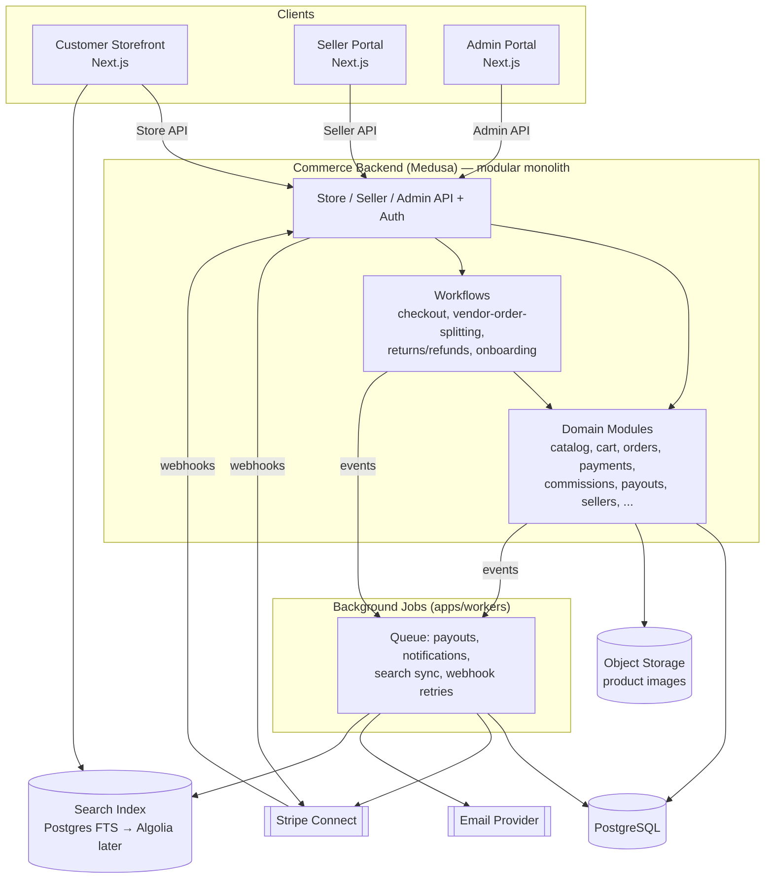

# Bawi Shopping — Architecture

## 1. Principles

- **Modular monolith first.** One deployable backend service (Medusa), internally organized into isolated modules with explicit boundaries and their own tables. No microservices, no separate databases per domain, no network hop between modules.
- **Apps are thin clients.** The storefront, seller portal, and admin portal contain presentation and light request-shaping logic only. All business rules, validation, and state transitions live in the Medusa backend (modules + workflows), reachable only through its APIs.
- **Vendor scoping is structural, not incidental.** Every seller-owned table carries `vendor_id`, and every module's service layer enforces that scope internally — callers cannot opt out of it by forgetting a `WHERE` clause.
- **Boring technology.** Prefer Medusa's and Next.js's built-in capabilities over adding libraries. Every new dependency must justify itself against "can the framework already do this."

## 2. Applications

Five deployables, one repo:

| App | Responsibility | Notes |
|---|---|---|
| **Customer storefront** (`apps/storefront`) | Browsing, search, cart, checkout, order tracking, reviews | Next.js, public-facing, SEO-relevant (SSR/ISR for product/category pages) |
| **Seller portal** (`apps/seller-portal`) | Seller onboarding, catalog/inventory/pricing management, order fulfillment, shipping, returns handling, payouts, reporting | Next.js, authenticated, seller-actor session |
| **Admin portal** (`apps/admin`) | Seller approval, moderation, commission configuration, platform reporting, audit log review | Next.js, authenticated, admin-actor session, can also embed/extend Medusa's own admin UI where it fits |
| **Commerce backend** (`apps/backend`) | Medusa instance: all modules, workflows, REST/Store/Admin APIs, webhook receivers | Node/TypeScript, the only app with direct DB access |
| **Background jobs** (`apps/workers`) | Scheduled jobs and queue consumers: payouts, search index sync, notification delivery, webhook retry, reporting rollups | Separate Node process from the API, shares the module layer as a library, scales independently |

Each frontend calls the commerce backend only through its published API surface (Store API for storefront, a seller-scoped API namespace for the seller portal, Admin API for the admin portal). No frontend talks to PostgreSQL directly.

## 3. System diagram



## 4. Module map

Medusa v2 ships a set of native commerce modules; the marketplace-specific concepts (sellers, commissions, payouts, vendor-order splitting, moderation, audit logs) do not exist natively and are built as first-class custom Medusa modules following the same module conventions (own tables, own service, own migrations, linked to core modules via Medusa's module-link system rather than foreign keys reaching across module boundaries).

| Required domain | Implementation | Notes |
|---|---|---|
| Authentication | Native Medusa `auth` module | Extended with three actor types: `customer` (native), `seller_user` (custom — see below), `user` (native, admin) |
| Customers | Native Medusa `customer` module | Unmodified |
| Sellers | **Custom module: `seller`** (implemented) | Root of vendor scoping; owns `vendor_id`. Currently: `Seller` + `SellerUser` models only (name, slug, status, role) — onboarding/Stripe fields land with the seller-onboarding slice. |
| Seller onboarding | **Custom module: `seller-onboarding`** | Application review + Stripe Connect Express account linking |
| Catalog | Native Medusa `product` module (as catalog container) | — |
| Categories | Native Medusa `product-category` module | Platform-owned taxonomy |
| Products | Native Medusa `product` module | Extended with a module-link to `seller` (`vendor_id`) |
| Product variants | Native Medusa `product` module (variants) | Inherits `vendor_id` from parent product |
| Inventory | Native Medusa `inventory` module | Stock locations scoped per seller |
| Pricing | Native Medusa `pricing` module | Prices owned by the seller's variant |
| Search | **Custom module: `search`** | Interface/adapter pattern; Postgres FTS adapter now, Algolia adapter later (see §6) |
| Cart | Native Medusa `cart` module | Unmodified; holds multi-seller line items |
| Checkout | **Custom workflow, not a module**: `checkout` orchestration | Composes cart, pricing, inventory, payment, vendor-order-splitting |
| Payments | Native Medusa `payment` module + **custom Stripe Connect payment provider** | See [`PAYMENTS.md`](PAYMENTS.md) |
| Commissions | **Custom module: `commission`** | Rate resolution + ledger |
| Payouts | **Custom module: `payout`** | Stripe Transfer orchestration, run from `apps/workers` |
| Orders | Native Medusa `order` module | Represents the customer-facing order group |
| Vendor-order splitting | **Custom module: `vendor-order`** + splitting workflow | One `vendor_order` per seller per order |
| Shipping | Native Medusa `fulfillment` module | Seller-scoped shipping options/providers |
| Returns | Native Medusa `order` return workflows | Extended for per-vendor-order scope |
| Refunds | Native Medusa `payment` module refund flow | Extended to trigger commission reversal |
| Reviews | **Custom module: `review`** | Verified-purchase gated |
| Moderation | **Custom module: `moderation`** | Polymorphic queue over products/reviews |
| Notifications | Native Medusa `notification` module | Email provider + templates, dedup log |
| Reporting | **Custom module: `reporting`** | Read-side aggregation over existing modules, no owned source-of-truth data |
| Audit logs | **Custom module: `audit-log`** | Cross-cutting event subscriber, append-only |

Custom modules communicate with native modules exclusively through Medusa's module-link and workflow/event-subscriber mechanisms — never direct cross-module table joins — preserving the modular-monolith boundary so any module could theoretically be extracted into its own service later without a rewrite.

### 4.1 The `seller_user` actor type (implemented)

Medusa v2's `auth` module is actor-type-agnostic: `/auth/:actor_type/:auth_provider/*` works for any actor type string without separate registration. `seller_user` needs no auth-module config beyond what's already there — the actual work is:

1. A `seller_user` row is created in the custom `seller` module, linked to a freshly-created `auth_identity` by id.
2. That `auth_identity`'s `app_metadata.seller_user_id` is set to the `SellerUser` row's id (`authModuleService.updateAuthIdentities(...)`).
3. Medusa's own JWT issuance then sets the token's `actor_id` claim to that same id — so an authenticated request's `req.auth_context.actor_id` *is* the `SellerUser.id`, resolved entirely server-side.
4. Routes under `/seller/*` are protected by `authenticate("seller_user", ["bearer", "session"])` in `apps/backend/src/api/middlewares.ts`. `GET /seller/me` (`apps/backend/src/api/seller/me/route.ts`) is the only place a session is turned into a `vendor_id` — see `docs/DECISIONS.md` for the full reasoning and `docs/SECURITY.md` §2 for the isolation guarantee this gives.

Sellers aren't self-registering yet (that arrives with the seller-onboarding slice, where step 1–2 above happen on application approval instead of a script). For now, `apps/backend/src/scripts/seed-seller.ts` (a `medusa exec` script) provisions a seller for local development and is what the integration/E2E tests use.

## 5. Data flow boundary rules

- A module's service is the only code allowed to query its own tables. Other modules go through its public service API or an event.
- Cross-module orchestration (e.g., checkout touching cart, inventory, pricing, payment, and vendor-order-splitting) lives in a **workflow**, not inside any one module's service, and not inside a frontend app.
- Frontends never construct SQL, never import a module's service directly, and never receive more than the fields their role is authorized to see (API responses are explicitly shaped per actor type, not "return the whole row and let the client filter").

## 6. Search: interface-first design

```
packages/search-contract        (SearchService interface, query/result types)
apps/backend/src/modules/search
  ├─ postgres-adapter.ts         (v1: tsvector + GIN index queries)
  └─ algolia-adapter.ts          (future: swapped in via config, no caller changes)
```

The `search` module exposes `search(query, filters)`, `indexProduct(product)`, `removeFromIndex(productId)`. Event subscribers on product publish/update/unpublish and seller suspension call these methods; nothing else in the codebase talks to Postgres FTS or Algolia directly. Switching providers later is a config change plus a new adapter file, not a rewrite of calling code.

## 7. Background jobs

`apps/workers` runs as an independent process from `apps/backend`'s API server (same codebase/modules, different entrypoint), so a slow payout batch or notification burst never adds latency to customer-facing API requests. Responsibilities:

- Payout batch execution (Stripe Transfers).
- Notification delivery (email) with retry/backoff.
- Search index synchronization.
- Stripe webhook retry handling for transient failures.
- Scheduled reporting rollups.

Queue backend: Redis-backed job queue (a single well-supported library, not a bespoke one — finalized in [`IMPLEMENTATION-PLAN.md`](IMPLEMENTATION-PLAN.md) Phase setup). Medusa's own scheduled-jobs/subscriber primitives are used first wherever they suffice, before introducing the external queue for anything that needs cross-process durability or retry semantics.

## 8. Monorepo structure

```
bawi-shopping/
├── apps/
│   ├── storefront/            # Next.js — customer-facing
│   ├── seller-portal/         # Next.js — seller-facing
│   ├── admin/                 # Next.js — platform-staff-facing
│   ├── backend/               # Medusa — modules, workflows, APIs, webhooks
│   └── workers/                # background job runner (shares backend's modules as a library)
├── packages/
│   ├── ui/                    # shared design system (components, tokens) — see DESIGN-SYSTEM.md
│   ├── types/                 # shared TS types/DTOs across frontends and backend
│   ├── search-contract/       # SearchService interface + adapters' shared types
│   ├── config/                # shared eslint/tsconfig/tailwind config
│   └── utils/                 # small cross-app pure utilities (formatting, constants)
├── docs/                      # this documentation set
├── package.json               # npm workspaces ("workspaces": ["apps/*", "packages/*"])
├── turbo.json
└── CLAUDE.md
```

Rationale for npm workspaces + Turborepo: minimal, ships with Node (no extra global install), first-class TypeScript project-reference support, incremental task caching for lint/build/test across five apps and several packages without introducing a heavier build system. Originally planned as pnpm workspaces; changed to npm workspaces for a local-environment reason, not an architectural one — see [`DECISIONS.md`](DECISIONS.md).

## 9. Tech stack summary

| Concern | Choice |
|---|---|
| Backend framework | Medusa 2.x (Node.js/TypeScript) |
| Database | PostgreSQL (single instance, single database, module-owned tables) |
| Frontends | Next.js (App Router) + TypeScript (×3 apps) |
| Validation | Zod, at every Server Action boundary |
| Design system | Shared internal package (`packages/ui`), see [`DESIGN-SYSTEM.md`](DESIGN-SYSTEM.md) |
| Payments | Stripe Connect (Express accounts) |
| Object storage | S3-compatible bucket for product images, served via CDN |
| Search | Postgres full-text search (v1) behind an interface, Algolia adapter later |
| Background jobs | Dedicated worker process + Redis-backed queue |
| Monorepo tooling | npm workspaces + Turborepo — see [`DECISIONS.md`](DECISIONS.md) |
| Testing | Vitest + React Testing Library + Playwright (frontends); Medusa's own Jest-based tooling (backend) — see [`DECISIONS.md`](DECISIONS.md) |
| Migrations | Medusa/MikroORM migration CLI per module — see [`DATABASE.md`](DATABASE.md) |

## 10. Environments

Three standard environments (local, staging, production), each with its own PostgreSQL database, Stripe Connect test/live mode pairing (test in local/staging, live in production only), and object storage bucket. No environment shares a database or Stripe account with another. Concrete provisioning steps are deferred to [`IMPLEMENTATION-PLAN.md`](IMPLEMENTATION-PLAN.md) — this document defines shape, not hosting choices.
