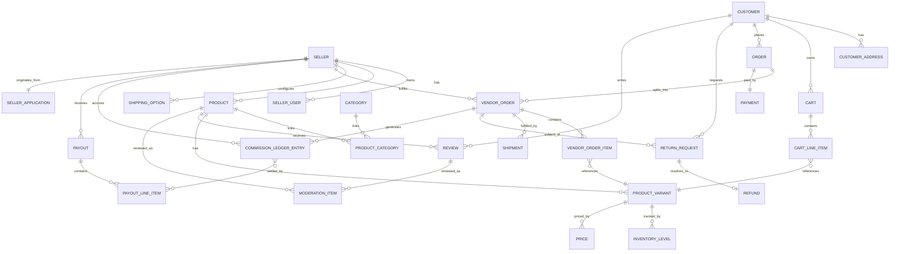

# Bawi Shopping — Database

## 1. Approach

- Single PostgreSQL database, single schema, module-owned tables — matching Medusa's own convention (each module, native or custom, owns and migrates its tables independently).
- **Every table that represents seller-owned data carries a `vendor_id` column** (FK to `seller.id`), enforced `NOT NULL` at the schema level for those tables. There is no seller-scoped table without it.
- All schema changes ship as migrations (Medusa/MikroORM migration CLI per module). No manual DDL in any environment, including local — the migration is the only source of truth for schema history.
- Primary keys: ULIDs/UUIDs (Medusa's default ID convention), not sequential integers, to avoid enumeration and to keep IDs safe to expose in URLs.
- Monetary values stored as integers in minor units (cents), never floats — required for commission/payout arithmetic correctness (see [`PAYMENTS.md`](PAYMENTS.md)).
- Timestamps: `created_at`, `updated_at` on every table; `deleted_at` (soft delete) only where order-history integrity requires preserving a row after logical deletion (e.g., products), not used as a general-purpose pattern.

## 2. Entity-relationship overview

## 3. Table ownership by module

| Module | Tables owned | `vendor_id`? |
|---|---|---|
| `authentication` | `auth_identity`, `provider_identity` | No — global identities |
| `customer` | `customer`, `customer_address` | No |
| `seller` (implemented) | `seller`, `seller_user` | `seller.id` is the vendor key itself. `role` is a plain enum column on `seller_user`, not a separate table (simpler than originally sketched — no need for a join table at this scale). |
| `seller-application` (implemented) | `seller_application` | No (platform-owned; references `seller.id` via a plain `seller_id` column once approved — not a formal Medusa module-link, see [`DECISIONS.md`](DECISIONS.md)) |
| `product` (native Medusa) | `product`, `product_variant`, `product_option`, `product_image` | No native column - ownership is layered on via `product-listing` below, not a native Medusa field |
| `product-listing` (implemented) | `product_listing` | **Yes** — this is the actual vendor-ownership anchor for products; `product_listing.product_id` is a plain reference to the native `product.id` (same loose-coupling pattern as `seller_application.seller_id`, see [`DECISIONS.md`](DECISIONS.md)) |
| `product-category` (native Medusa, admin-editable — implemented) | `product_category` | No (platform-owned taxonomy) |
| `category-translation` (implemented) | `category_translation` | No (platform-owned) |
| `inventory` (native Medusa) | `inventory_item`, `inventory_level`, `reservation` | No native column - scoped indirectly via the owning product's `product_listing.vendor_id` |
| `pricing` (native Medusa) | `price`, `price_set` | No native column - same indirect scoping as inventory |
| `search` | (index only, no owned source-of-truth table) | n/a |
| `cart` | `cart`, `cart_line_item` | No (customer/session-owned) |
| `payment` | `payment`, `payment_intent_ref` | No (order-owned, cross-vendor) |
| `commission` | `commission_rule`, `commission_ledger_entry` | **Yes** (ledger entries) |
| `payout` | `payout`, `payout_line_item` | **Yes** |
| `order` | `order` | No (customer-owned, cross-vendor group) |
| `vendor-order` | `vendor_order`, `vendor_order_item` | **Yes** |
| `fulfillment` (shipping) | `shipping_option`, `shipment` | **Yes** |
| `order` returns/refunds | `return_request`, `refund` | **Yes** (via vendor_order) |
| `review` | `review`, `review_response` | **Yes** (via product) |
| `moderation` | `moderation_item`, `moderation_flag` | No (platform-owned, references seller-owned content) |
| `notification` | `notification_template`, `notification_log` | Nullable — set when the notification concerns a specific seller |
| `reporting` | (no owned tables — aggregation views/queries only) | n/a |
| `audit-log` (implemented) | `audit_log` | Nullable — set when the logged action is seller-scoped |

## 4. Key tables (illustrative columns, not final DDL)

**`seller`** *(migrated — `apps/backend/src/modules/seller/migrations`)*
`id, name, slug (unique, partial index on deleted_at IS NULL), status (pending|approved|suspended|rejected, default 'pending'), created_at, updated_at, deleted_at`

Still to come with the seller-onboarding slice: `description`, `logo_url`, `support_email`, `stripe_account_id`, `stripe_charges_enabled`, `stripe_payouts_enabled`, `commission_rate_override`. Not added yet — this migration only covers what registration/login/vendor-association needed (see `docs/DECISIONS.md`).

**`seller_user`** *(migrated — same module)*
`id, email (text, NOT NULL - the login identity, set at creation time independent of activation), auth_identity_id (text, nullable - links to Medusa's auth_identity via app_metadata.seller_user_id once activated, see ARCHITECTURE.md §4.1), role (owner|catalog_manager|order_fulfiller|analyst, default 'owner'), activation_token (text, nullable, unique), activation_token_expires_at (timestamptz, nullable), seller_id (FK → seller.id, NOT NULL, indexed), created_at, updated_at, deleted_at`

**`seller_application`** *(migrated — `apps/backend/src/modules/seller-application/migrations`)*
`id, legal_business_name, store_name, business_type (sole_proprietorship|llc|corporation|partnership|other), business_description, estimated_product_count (integer), product_categories (jsonb array), address (jsonb: line1/line2/city/state/postal_code/country), contact_first_name, contact_last_name, business_email, phone_number, website_url (nullable), agreed_to_terms (boolean), submitted_at (timestamptz), status (draft|submitted|under_review|approved|rejected|withdrawn, default 'submitted'), rejection_reason (text, nullable, PRIVATE - never returned from a public endpoint), reviewed_by (text, nullable - Medusa `user.id`, always server-derived from the session, never client input), reviewed_at (timestamptz, nullable), seller_id (text, nullable - set on approval), created_at, updated_at, deleted_at`

No bank account, card, tax ID, SSN, or identity-document fields are collected at this stage — those belong to the future Stripe Connect onboarding slice (see `docs/PAYMENTS.md`).

**`product`**, **`product_variant`** *(native Medusa tables, unmodified — no custom migration)* — standard Medusa columns (`title`, `description`, `status`, `handle`/slug, `options`/`option values`, variant `sku`, etc.). No `vendor_id` or permanent code column exists on these tables natively - see `product_listing` below for where that ownership actually lives. The variant's native `sku` column is where the seller's private SKU is stored; it's private by response-shaping (never selected/returned on the public `GET /products/:code` route or any customer-facing payload — see [`SECURITY.md`](SECURITY.md) §11), not by a schema-level flag.

**`product_listing`** *(migrated — `apps/backend/src/modules/product-listing/migrations`)*
`id, product_id (text, unique — plain reference to the native product.id, same loose-coupling pattern as seller_application.seller_id, not a hard FK or Medusa module-link), vendor_id (FK → seller.id, NOT NULL, indexed - the actual ownership anchor for the product), product_code (text, unique, permanent — issued once, never reused/reassigned even if the product is retitled/re-slugged/archived; distinct from the native product's mutable handle/slug — see [`DECISIONS.md`](DECISIONS.md)), status (draft|pending_review|approved|rejected|archived, default 'draft', indexed), rejection_reason (text, nullable, PRIVATE — never returned from a public endpoint), submitted_at (timestamptz, nullable), reviewed_by (text, nullable — Medusa `user.id`, always server-derived), reviewed_at (timestamptz, nullable), created_at, updated_at, deleted_at`

Approving a listing sets its own `status = approved` *and* flips the native `product.status` to `published` (in the same atomic workflow, see [`DECISIONS.md`](DECISIONS.md)) - native Medusa mechanics and this module's own authorization check both agree on visibility, rather than relying on a single flag.

**`product_category`** *(native Medusa table, unmodified — no custom migration)* — `id, name, description, handle, mpath (materialized path, native ancestor/descendant support), is_active, is_internal, rank, parent_category_id (self-referential FK, nullable), created_at, updated_at, deleted_at`. Full parent/child taxonomy already exists natively; nothing custom was needed for category *structure*, only for translations (below). Category CRUD goes through Medusa's native `createProductCategoriesWorkflow`/`updateProductCategoriesWorkflow`/`deleteProductCategoriesWorkflow` (composed as steps in this project's own `create-category`/`update-category`/`delete-category` workflows alongside translation writes and the audit log — see `docs/DECISIONS.md`).

**`category_translation`** *(migrated — `apps/backend/src/modules/category-translation/migrations`)*
`id, category_id (text, unique per locale — plain reference to the native product_category.id, same loose-coupling pattern as product_listing.product_id), locale (am|ti|om|zh-CN|es — en-US is deliberately excluded, see below), name, created_at, updated_at, deleted_at`. Unique index on `(category_id, locale)`. English is never stored here: the native `product_category.name` row **is** the English content (same "base row implicit" convention as the deferred `product_translation` table below) — a missing translation row for a locale falls back to that native `name` at read time, never a blank string. Categories are platform-owned and admin-authored directly, so unlike `product_translation` there is no separate seller-submission/approval sub-state — an admin write is immediately live.

**Deferred (not part of this slice's migrations):**
- **`product_translation`** *(planned)* — `product_id (FK), locale (en-US|am|ti|om|zh-CN|es), title, description, status (draft|pending_review|approved), submitted_by, approved_by, created_at, updated_at`. Keyed by `product_id` + `locale`, entirely separate from `product` — the base `product` row's title/description are implicitly the English content, and this table is never collapsed into per-locale columns on `product` itself, and there is never a duplicate `product` row per language. Sellers (or AI) may create a row here; only Bawi (admin) approval makes it customer-visible — same shape as product approval itself. See `docs/PRD.md` §9.24, `docs/DECISIONS.md`.
- **`fulfillment_code` / `pickup_code` / `tracking_code` tables** *(planned)* — three distinct, order-scoped temporary codes (not one shared code) supporting the private-fulfillment model (`docs/PRD.md` §9.23, `docs/SECURITY.md` §11). Not designed yet beyond: all three must be unguessable (same non-sequential-ID principle as order IDs); pickup codes are single-use and expire immediately on collection (event-based, not just a TTL); none of these is the permanent `product_listing.product_code`, which is a separate, unrelated concept.
- **`courier` tables** *(planned)* — a courier's assignment scope must resolve to exactly the one delivery they're assigned, never a broader account/order query surface; no customer or vendor PII beyond what a specific handoff requires. See `docs/USER-ROLES.md` §2.7.

**`order`** (customer-facing group)
`id, customer_id (FK, NOT NULL), status, currency (USD), total_amount, shipping_address_id, created_at, updated_at`

**`vendor_order`**
`id, order_id (FK, NOT NULL), vendor_id (FK → seller.id, NOT NULL), status (pending|confirmed|shipped|delivered|cancelled|returned), subtotal_amount, shipping_amount, created_at, updated_at`

**`vendor_order_item`**
`id, vendor_order_id (FK, NOT NULL), vendor_id (FK, NOT NULL, denormalized), product_variant_id (FK, NOT NULL), quantity, unit_price_amount, created_at`

**`commission_ledger_entry`**
`id, vendor_order_id (FK, NOT NULL), vendor_id (FK, NOT NULL), rate_applied, amount (signed integer cents; negative = reversal), reason (order|refund_reversal), created_at`

**`payout`**
`id, vendor_id (FK, NOT NULL), stripe_transfer_id, amount, status (pending|paid|failed), created_at, updated_at`

**`payout_line_item`**
`id, payout_id (FK, NOT NULL), commission_ledger_entry_id (FK, NOT NULL), amount, created_at`

**`return_request`**
`id, vendor_order_item_id (FK, NOT NULL), vendor_id (FK, NOT NULL, denormalized), customer_id (FK, NOT NULL), status (requested|approved|denied|refunded), reason, created_at, updated_at`

**`audit_log`** *(migrated — `apps/backend/src/modules/audit-log/migrations`)*
`id, actor_type (customer|seller_user|user|system), actor_id (nullable), action, entity_type, entity_id, vendor_id (nullable), before_state (jsonb, nullable), after_state (jsonb, nullable), ip_address (nullable), created_at, updated_at, deleted_at` — append-only *by convention* today: no application code path issues UPDATE/DELETE against it, but the DB role's grants aren't yet restricted to enforce this at the database level (still a documented future hardening step, see `docs/SECURITY.md` §6). Note the actor_type value is `user` (matching Medusa's actual native admin actor type name), not `admin_user` as originally sketched.

Full, authoritative DDL is written as migrations during implementation, not hand-maintained in this document — this table list defines the contract each migration must satisfy.

## 5. Vendor-scoping enforcement at the data layer

- Every seller-scoped table's row can be reached only through its module's service, and that service always applies `WHERE vendor_id = :callerVendorId` for seller-actor callers — never an optional filter.
- Denormalized `vendor_id` columns on child tables (e.g., `product_variant.vendor_id`, `vendor_order_item.vendor_id`) exist specifically so scoped queries don't need a join through the parent to enforce isolation, and so a missing join can't accidentally widen a query's scope.
- Postgres Row-Level Security (RLS) as an additional defense-in-depth layer is documented as a future hardening option, not required for v1 — see [`SECURITY.md`](SECURITY.md) §"Defense in depth."

## 6. Migration policy

- One migration per schema change, per module, generated via Medusa's/MikroORM's migration tooling — never edited by hand after being applied to any shared environment.
- Migrations run automatically in CI against a disposable database as a merge gate; they run in staging before production, never directly against production first.
- Destructive migrations (column/table drops) require a prior release that stops writing to the column/table, per standard expand/contract practice — not enforced by tooling in v1, but stated here as the working convention until automated.
- No seed data ships with production migrations; local/staging seed data is a separate, clearly-labeled script.
