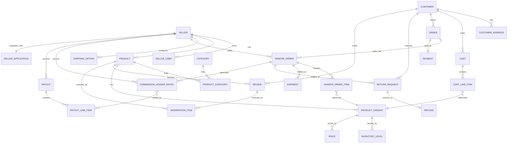

# Bawi Shopping — Database

## 1. Approach

- Single PostgreSQL database, single schema, module-owned tables — matching Medusa's own convention (each module, native or custom, owns and migrates its tables independently).
- **Every table that represents seller-owned data carries a `vendor_id` column** (FK to `seller.id`), enforced `NOT NULL` at the schema level for those tables. There is no seller-scoped table without it.
- All schema changes ship as migrations (Medusa/MikroORM migration CLI per module). No manual DDL in any environment, including local — the migration is the only source of truth for schema history.
- Primary keys: ULIDs/UUIDs (Medusa's default ID convention), not sequential integers, to avoid enumeration and to keep IDs safe to expose in URLs.
- Monetary values stored as integers in minor units (cents), never floats — required for commission/payout arithmetic correctness (see [`PAYMENTS.md`](PAYMENTS.md)).
- Timestamps: `created_at`, `updated_at` on every table; `deleted_at` (soft delete) only where order-history integrity requires preserving a row after logical deletion (e.g., products), not used as a general-purpose pattern.

## 2. Entity-relationship overview

## 3. Table ownership by module

| Module | Tables owned | `vendor_id`? |
|---|---|---|
| `authentication` | `auth_identity`, `provider_identity` | No — global identities |
| `customer` | `customer`, `customer_address` | No |
| `seller` (implemented) | `seller`, `seller_user` | `seller.id` is the vendor key itself. `role` is a plain enum column on `seller_user`, not a separate table (simpler than originally sketched — no need for a join table at this scale). |
| `business-config` (implemented) | `business_config_entry` | No (platform-owned) |
| `webhook-event` (implemented) | `processed_webhook_event` | No (platform-owned; idempotency ledger for external-provider webhooks, e.g. Stripe) |
| `cart-merge` (implemented) | `cart_merge_claim` | No (platform-owned; idempotency/concurrency ledger for guest-to-customer cart merges - same shape and purpose as `webhook-event`, see [`DECISIONS.md`](DECISIONS.md)) |
| `seller-application` (implemented) | `seller_application` | No (platform-owned; references `seller.id` via a plain `seller_id` column once approved — not a formal Medusa module-link, see [`DECISIONS.md`](DECISIONS.md)) |
| `product` (native Medusa) | `product`, `product_variant`, `product_option`, `product_image` | No native column - ownership is layered on via `product-listing` below, not a native Medusa field |
| `product-listing` (implemented) | `product_listing` | **Yes** — this is the actual vendor-ownership anchor for products; `product_listing.product_id` is a plain reference to the native `product.id` (same loose-coupling pattern as `seller_application.seller_id`, see [`DECISIONS.md`](DECISIONS.md)) |
| `product-category` (native Medusa, admin-editable — implemented) | `product_category` | No (platform-owned taxonomy) |
| `category-translation` (implemented) | `category_translation` | No (platform-owned) |
| `inventory` (native Medusa) | `inventory_item`, `inventory_level`, `reservation` | No native column - scoped indirectly via the owning product's `product_listing.vendor_id` |
| `pricing` (native Medusa) | `price`, `price_set` | No native column - same indirect scoping as inventory |
| `search` | (index only, no owned source-of-truth table) | n/a |
| `cart` (native Medusa, implemented) | `cart`, `cart_line_item` (unmodified schema) | No (customer/session-owned) - vendor ownership per line item lives only in `cart_line_item.metadata.vendor_id`, not a column, and is never selected into any response (see `apps/backend/src/cart/cart-response.ts`, [`DECISIONS.md`](DECISIONS.md)) |
| `seller-finance` (implemented) | `commission_ledger_entry`, `payout`, `payout_line_item`, `return_request`, `order_refund`, `dispute` | **Yes** on all six (plain `vendor_id`/`vendor_order_id` reference, not a Medusa DML relation - separate module from `marketplace-order`/`seller`, see [`DECISIONS.md`](DECISIONS.md)); `dispute.vendor_order_id` is nullable since one dispute can span multiple vendor_orders |
| `marketplace-order` (implemented) | `marketplace_order`, `vendor_order`, `vendor_order_item` | `marketplace_order`: no (customer-owned, cross-vendor group). `vendor_order`/`vendor_order_item`: **yes** (plain `vendor_id` reference, not a Medusa DML relation - the module and `seller` are separate modules, see [`DECISIONS.md`](DECISIONS.md)). Combines what was originally sketched as three separate modules (`order`, `vendor-order`, `payment`) into one - same one-module-multiple-models precedent as `seller`/`seller_user`, see [`DECISIONS.md`](DECISIONS.md) |
| `fulfillment` (shipping) | `shipping_option`, `shipment` | **Yes** - not yet built |
| `fulfillment-privacy` (implemented) | `courier`, `pickup_code`, `tracking_code`, `fulfillment_code_redemption` | `courier`: no (platform-owned, its own actor type). `pickup_code`/`tracking_code`: no (order-scoped by `vendor_order_id`, a plain reference - vendor identity is never exposed through either). `fulfillment_code_redemption`: no (platform-owned idempotency/claim ledger, same shape as `webhook_event`/`cart_merge_claim`) |
| `review` | `review`, `review_response` | **Yes** (via product) |
| `moderation` | `moderation_item`, `moderation_flag` | No (platform-owned, references seller-owned content) |
| `notification` | `notification_template`, `notification_log` | Nullable — set when the notification concerns a specific seller |
| `reporting` | (no owned tables — aggregation views/queries only) | n/a |
| `audit-log` (implemented) | `audit_log` | Nullable — set when the logged action is seller-scoped |

## 4. Key tables (illustrative columns, not final DDL)

**`seller`** *(migrated — `apps/backend/src/modules/seller/migrations`)*
`id, name, slug (unique, partial index on deleted_at IS NULL), status (pending|approved|suspended|rejected, default 'pending'), stripe_account_id (text, nullable, unique — opaque Stripe Connect Express account reference, never a full account object), stripe_charges_enabled (boolean, default false), stripe_payouts_enabled (boolean, default false), stripe_details_submitted (boolean, default false), public_brand_display_approved (boolean, default false — a vendor's own store name/brand is private until Bawi admin explicitly approves public display, see docs/DECISIONS.md), created_at, updated_at, deleted_at`

**No bank account, card, identity-document, or tax-ID fields are ever added to this table** — Stripe hosts all of that as part of Express onboarding; the platform stores only the account-id reference and the three status booleans, derived exclusively from `account.updated` webhooks (see `docs/DECISIONS.md`, `docs/PAYMENTS.md` §2). Still to come with a later payments slice: `description`, `logo_url`, `support_email`, `commission_rate_override` (an admin-set override read by the `business-config` rate-resolution order: seller-specific override → category default → platform default).

**`business_config_entry`** *(migrated — `apps/backend/src/modules/business-config/migrations`)*
`id, category (commission|transfer_timing|returns|shipping|preparation|cancellation|service_area|brand_visibility|payment_methods|tax|courier|email|sms|support|cart|feature_flag), key (text), value (jsonb), value_type (integer|boolean|string|json), label (text), description (text, nullable), is_placeholder (boolean, default false — true for a seeded development/staging value standing in for a real, still-pending business/legal decision), is_sensitive (boolean, default false), updated_by (text, nullable — Medusa `user.id`, always server-derived), created_at, updated_at, deleted_at`. Unique index on `(category, key)`. Every write is recorded in `audit_log` (before/after value, actor) — see `docs/SECURITY.md` §12. The `cart` category (`cart_expiration_days` = 30, `max_quantity_per_line_item` = 10) was added in the multi-vendor-cart slice — both `is_placeholder: false`, a genuine v1 engineering default rather than a pending business/legal decision. The `tax` category gained `mock_rate_basis_points` (825 = 8.25%, `is_placeholder: true`) in the checkout slice — the mock tax adapter's flat rate, applied uniformly regardless of shipping address until a real tax provider replaces it (see [`DECISIONS.md`](DECISIONS.md)).

**`processed_webhook_event`** *(migrated — `apps/backend/src/modules/webhook-event/migrations`)*
`id, provider (text, e.g. 'stripe'), event_id (text, unique per provider), event_type (text), processed_at (timestamptz), created_at`. The idempotency mechanism required by `docs/PAYMENTS.md` §7 and CLAUDE.md's payment-webhook rule: a handler checks this table for `(provider, event_id)` before applying any side effect, and inserts a row atomically with that side effect so a Stripe redelivery of the same event can never double-apply it.

**`cart_merge_claim`** *(migrated — `apps/backend/src/modules/cart-merge/migrations`)*
`id, guest_cart_id (text, unique), customer_id (text), claimed_at (timestamptz), created_at`. Same mechanism as `processed_webhook_event`, applied to a different problem: a unique-index `INSERT` that atomically claims a guest cart id before any cart-merge side effect runs, so two truly concurrent merge requests for the same guest cart (not just sequential replays) can never both proceed and duplicate line items — see `docs/DECISIONS.md`.

**`seller_user`** *(migrated — same module)*
`id, email (text, NOT NULL - the login identity, set at creation time independent of activation), auth_identity_id (text, nullable - links to Medusa's auth_identity via app_metadata.seller_user_id once activated, see ARCHITECTURE.md §4.1), role (owner|catalog_manager|order_fulfiller|analyst, default 'owner'), activation_token (text, nullable, unique), activation_token_expires_at (timestamptz, nullable), seller_id (FK → seller.id, NOT NULL, indexed), created_at, updated_at, deleted_at`

**`seller_application`** *(migrated — `apps/backend/src/modules/seller-application/migrations`)*
`id, legal_business_name, store_name, business_type (sole_proprietorship|llc|corporation|partnership|other), business_description, estimated_product_count (integer), product_categories (jsonb array), address (jsonb: line1/line2/city/state/postal_code/country), contact_first_name, contact_last_name, business_email, phone_number, website_url (nullable), agreed_to_terms (boolean), submitted_at (timestamptz), status (draft|submitted|under_review|approved|rejected|withdrawn, default 'submitted'), rejection_reason (text, nullable, PRIVATE - never returned from a public endpoint), reviewed_by (text, nullable - Medusa `user.id`, always server-derived from the session, never client input), reviewed_at (timestamptz, nullable), seller_id (text, nullable - set on approval), created_at, updated_at, deleted_at`

No bank account, card, tax ID, SSN, or identity-document fields are collected at this stage — those belong to the future Stripe Connect onboarding slice (see `docs/PAYMENTS.md`).

**`product`**, **`product_variant`** *(native Medusa tables, unmodified — no custom migration)* — standard Medusa columns (`title`, `description`, `status`, `handle`/slug, `options`/`option values`, variant `sku`, etc.). No `vendor_id` or permanent code column exists on these tables natively - see `product_listing` below for where that ownership actually lives. The variant's native `sku` column is where the seller's private SKU is stored; it's private by response-shaping (never selected/returned on the public `GET /products/:code` route or any customer-facing payload — see [`SECURITY.md`](SECURITY.md) §11), not by a schema-level flag.

**`product_listing`** *(migrated — `apps/backend/src/modules/product-listing/migrations`)*
`id, product_id (text, unique — plain reference to the native product.id, same loose-coupling pattern as seller_application.seller_id, not a hard FK or Medusa module-link), vendor_id (FK → seller.id, NOT NULL, indexed - the actual ownership anchor for the product), product_code (text, unique, permanent — issued once, never reused/reassigned even if the product is retitled/re-slugged/archived; distinct from the native product's mutable handle/slug — see [`DECISIONS.md`](DECISIONS.md)), status (draft|pending_review|approved|rejected|archived, default 'draft', indexed), rejection_reason (text, nullable, PRIVATE — never returned from a public endpoint), submitted_at (timestamptz, nullable), reviewed_by (text, nullable — Medusa `user.id`, always server-derived), reviewed_at (timestamptz, nullable), created_at, updated_at, deleted_at`

Approving a listing sets its own `status = approved` *and* flips the native `product.status` to `published` (in the same atomic workflow, see [`DECISIONS.md`](DECISIONS.md)) - native Medusa mechanics and this module's own authorization check both agree on visibility, rather than relying on a single flag.

**`product_category`** *(native Medusa table, unmodified — no custom migration)* — `id, name, description, handle, mpath (materialized path, native ancestor/descendant support), is_active, is_internal, rank, parent_category_id (self-referential FK, nullable), created_at, updated_at, deleted_at`. Full parent/child taxonomy already exists natively; nothing custom was needed for category *structure*, only for translations (below). Category CRUD goes through Medusa's native `createProductCategoriesWorkflow`/`updateProductCategoriesWorkflow`/`deleteProductCategoriesWorkflow` (composed as steps in this project's own `create-category`/`update-category`/`delete-category` workflows alongside translation writes and the audit log — see `docs/DECISIONS.md`).

**`category_translation`** *(migrated — `apps/backend/src/modules/category-translation/migrations`)*
`id, category_id (text, unique per locale — plain reference to the native product_category.id, same loose-coupling pattern as product_listing.product_id), locale (am|ti|om|zh-CN|es — en-US is deliberately excluded, see below), name, created_at, updated_at, deleted_at`. Unique index on `(category_id, locale)`. English is never stored here: the native `product_category.name` row **is** the English content (same "base row implicit" convention as the deferred `product_translation` table below) — a missing translation row for a locale falls back to that native `name` at read time, never a blank string. Categories are platform-owned and admin-authored directly, so unlike `product_translation` there is no separate seller-submission/approval sub-state — an admin write is immediately live.

**Deferred (not part of this slice's migrations):**
- **`product_translation`** *(planned)* — `product_id (FK), locale (en-US|am|ti|om|zh-CN|es), title, description, status (draft|pending_review|approved), submitted_by, approved_by, created_at, updated_at`. Keyed by `product_id` + `locale`, entirely separate from `product` — the base `product` row's title/description are implicitly the English content, and this table is never collapsed into per-locale columns on `product` itself, and there is never a duplicate `product` row per language. Sellers (or AI) may create a row here; only Bawi (admin) approval makes it customer-visible — same shape as product approval itself. See `docs/PRD.md` §9.24, `docs/DECISIONS.md`.
- **`fulfillment_code`, `pickup_code`, `tracking_code`, and `courier` are all implemented** (see the `courier`/`pickup_code`/`tracking_code`/`fulfillment_code_redemption` table entries above, and `vendor_order.fulfillment_code`) - three distinct, unguessable, order-scoped codes (never the permanent `product_listing.product_code`, a separate concept): `fulfillment_code` is a stable, non-expiring seller-facing reference; `pickup_code` and `tracking_code` are single-use (enforced by `fulfillment_code_redemption`'s atomic claim, not a status flag) and expire immediately on redemption - "on collection" is event-based, not merely a TTL, matching the original requirement exactly. A courier's assignment scope resolves to exactly the one `vendor_order` it's assigned (`vendor_order.assigned_courier_id`), never a broader account/order query surface; no customer PII or seller identity is ever included in a courier-facing response. See `docs/USER-ROLES.md` §2.7, `docs/DECISIONS.md`.

**`marketplace_order`** *(migrated — `apps/backend/src/modules/marketplace-order/migrations`, customer-facing, cross-vendor group)*
`id, display_id (text, unique — human-facing order number, never used for authorization), customer_id (text, NOT NULL), currency_code (default 'usd'), status (pending_payment|paid|payment_failed|cancelled, default 'pending_payment'), idempotency_key (text, unique, NOT NULL — one per checkout attempt, see docs/MARKETPLACE-FLOWS.md §1), subtotal_amount, shipping_amount, tax_amount, tax_rate_basis_points (snapshot), total_amount, shipping_address (jsonb — collected inline at checkout, not yet a reusable saved-address record, see docs/DECISIONS.md), line_items_snapshot (jsonb array — cart contents as of checkout-start, frozen so the per-vendor split at capture time never re-trusts a possibly-changed live cart), reservation_item_ids (jsonb array, nullable — inventory reservation ids, released if payment fails), stripe_payment_intent_id (text, unique, nullable), payment_status (pending|requires_action|succeeded|failed|canceled, default 'pending'), created_at, updated_at, deleted_at`

Payment lives directly on this row rather than a separate `payment` table as originally sketched — an order has exactly one PaymentIntent (1:1), so a join would be pure overhead (same reasoning as `seller_user.role` being a plain enum column, see [`DECISIONS.md`](DECISIONS.md)).

**`vendor_order`** *(migrated, same module)*
`id, vendor_id (text — plain reference to seller.id, not a DML relation), status (awaiting_preparation|preparing|ready_for_pickup|picked_up|out_for_delivery|delivered|cancelled|returned, default 'awaiting_preparation'), subtotal_amount, shipping_amount, tax_amount (all three: this vendor's proportional share of the order-level total, allocated by item-subtotal share - see docs/DECISIONS.md), commission_rate_basis_points, commission_amount (both snapshotted at creation - resolution order seller override → category default → platform default, see docs/PAYMENTS.md §4), total_amount, fulfillment_code (text, unique — opaque, non-expiring seller-facing reference, distinct from `pickup_code`/`tracking_code` below), fulfillment_deadline_at (timestamptz — computed from the `preparation` business-config category at creation), assigned_courier_id (text, nullable — plain reference to `courier.id`, set by an admin action once ready_for_pickup), preparing_at / ready_for_pickup_at / picked_up_at / out_for_delivery_at / delivered_at (timestamptz, nullable — one per lifecycle transition, powers the customer tracking timeline), order_id (FK → marketplace_order.id, NOT NULL, indexed), created_at, updated_at, deleted_at`

**`vendor_order_item`** *(migrated, same module)*
`id, vendor_id (text, denormalized), variant_id, product_id, product_code, title, thumbnail, color, size (all snapshotted at checkout time - never a live join back to the product/variant, so a later product edit/reprice/deletion can never alter what an already-placed order shows), unit_price_amount, quantity, line_total_amount, vendor_order_id (FK, NOT NULL, indexed), created_at, updated_at, deleted_at`

**`courier`** *(migrated — `apps/backend/src/modules/fulfillment-privacy/migrations`)*
`id, name, email (text, unique — the login identity), phone (text, nullable — internal ops contact, never shown to a customer or seller), auth_identity_id (nullable, links to Medusa's auth_identity via app_metadata.courier_id once activated, same pattern as seller_user), activation_token (text, nullable, unique), activation_token_expires_at (timestamptz, nullable), status (active|inactive, default 'active'), created_at, updated_at, deleted_at`

**`pickup_code`** / **`tracking_code`** *(migrated, same module — identical shape, different roles)*
`id, vendor_order_id (text, unique among non-deleted rows — one active code per vendor_order at a time), code (text, unique — unguessable, same non-sequential-id principle as order ids), expires_at (timestamptz — defense-in-depth TTL; actual single-use enforcement is `fulfillment_code_redemption` below, not this table), created_at, updated_at, deleted_at`. `pickup_code` is shown to the **seller** and redeemed by the **courier** to confirm pickup; `tracking_code` is shown to the **customer** and redeemed by the **courier** (proof of delivery) to confirm delivery - a courier never sees either code's value in advance, only what's submitted to it for server-side verification. Both are minted together, atomically, when a `vendor_order` transitions to `ready_for_pickup`.

**`fulfillment_code_redemption`** *(migrated, same module)*
`id, code_type (pickup|tracking), code_id (text, unique among non-deleted rows — a plain reference to either `pickup_code.id` or `tracking_code.id`, both globally-unique ULIDs so one column safely covers both), courier_id (text), redeemed_at (timestamptz), created_at, updated_at, deleted_at`. The atomic single-use claim: a courier's redemption attempt tries to `INSERT` a row keyed by `code_id`; a unique-constraint violation means the code was already redeemed (replay) - same proven pattern as `webhook_event`/`cart_merge_claim`, not an `UPDATE ... WHERE status = 'active'` conditional (see docs/DECISIONS.md for why that isn't safe under concurrency in this codebase).

**`commission_ledger_entry`** *(migrated — `apps/backend/src/modules/seller-finance/migrations`)*
`id, vendor_order_id (text, NOT NULL), vendor_id (text, NOT NULL), reason (order|refund_reversal), commission_rate_basis_points, commission_amount, net_amount (subtotal minus commission - the seller-balance-affecting figure; shipping/tax are Bawi's own revenue, see docs/DECISIONS.md), transfer_hold_days_snapshot (integer - snapshotted from business-config `transfer_timing` at capture time, same snapshotting principle as commission rate), available_at (timestamptz, nullable), paid_at (timestamptz, nullable), disputed_at (timestamptz, nullable), dispute_resolved_at (timestamptz, nullable), reverses_entry_id (text, nullable - the original entry a `refund_reversal` row reverses), created_at, updated_at, deleted_at`. **No stored status column** - pending/available/paid/disputed is derived at read time from the timestamp fields (`src/finance/balance.ts`'s `deriveLedgerBucket()`), since this project has no background job scheduler to keep a stored status in sync (see docs/DECISIONS.md).

**`payout`** *(migrated, same module)*
`id, vendor_id (text, NOT NULL), idempotency_key (text, unique, NOT NULL - derived from the exact sorted set of ledger-entry ids being paid), amount, status (pending|paid|failed, default 'pending'), stripe_transfer_id (text, unique, nullable), reconciled_at (timestamptz, nullable), created_at, updated_at, deleted_at`

**`payout_line_item`** *(migrated, same module)*
`id, payout_id (FK → payout.id, NOT NULL), commission_ledger_entry_id (text, unique - a ledger entry can be claimed by at most one payout, ever, enforced by this unique constraint rather than an application-level check), amount, created_at, updated_at, deleted_at`

**`return_request`** *(migrated, same module)*
`id, vendor_order_item_id (text, NOT NULL), vendor_order_id (text, NOT NULL), vendor_id (text, NOT NULL, denormalized), order_id (text, NOT NULL), customer_id (text, NOT NULL), reason (damaged|defective|incorrect|customer_remorse), customer_comment (text, nullable), status (requested|approved|denied|refunded, default 'requested'), seller_response (text, nullable, PRIVATE - never returned from a customer-facing endpoint, same tier as `seller_application.rejection_reason`), reviewed_by (text, nullable), reviewed_at (timestamptz, nullable), created_at, updated_at, deleted_at`

**`order_refund`** *(migrated, same module - named `OrderRefund`/`order_refund`, not `Refund`/`refund`: Medusa's native order/payment modules already define a "Refund" GraphQL type, and reusing that exact name fails schema merging - a second, distinct class of Medusa naming collision from the module-key collision found in Batch 1, see docs/DECISIONS.md)*
`id, return_request_id (text, unique, nullable - nullable because a pre-preparation cancellation also produces a refund with no return request behind it; Postgres doesn't count NULLs against a unique constraint, so "at most one refund per return request" still holds for the rows that do have one), order_id (text, NOT NULL), vendor_order_id (text, NOT NULL), amount (always server-computed from stored item/order data, capped at the item's line_total - never client-supplied), is_partial (boolean), stripe_refund_id (text, unique, nullable), status (pending|succeeded|failed, default 'pending'), created_at, updated_at, deleted_at`

**`dispute`** *(migrated, same module)*
`id, order_id (text, NOT NULL), vendor_order_id (text, nullable - set only when exactly one vendor_order exists on the order; a Stripe dispute is against the whole marketplace-order charge, which can span multiple vendor_orders), stripe_dispute_id (text, unique), amount, reason (text, nullable), status (open|won|lost, default 'open'), resolved_at (timestamptz, nullable), created_at, updated_at, deleted_at`. Created/updated only from the `charge.dispute.created`/`charge.dispute.closed` Stripe webhook events, never client-initiated.

**`audit_log`** *(migrated — `apps/backend/src/modules/audit-log/migrations`)*
`id, actor_type (customer|seller_user|user|system|courier — `courier` added in the private-fulfillment slice), actor_id (nullable), action, entity_type, entity_id, vendor_id (nullable), before_state (jsonb, nullable), after_state (jsonb, nullable), ip_address (nullable), created_at, updated_at, deleted_at` — append-only *by convention* today: no application code path issues UPDATE/DELETE against it, but the DB role's grants aren't yet restricted to enforce this at the database level (still a documented future hardening step, see `docs/SECURITY.md` §6). Note the actor_type value is `user` (matching Medusa's actual native admin actor type name), not `admin_user` as originally sketched.

Full, authoritative DDL is written as migrations during implementation, not hand-maintained in this document — this table list defines the contract each migration must satisfy.

## 5. Vendor-scoping enforcement at the data layer

- Every seller-scoped table's row can be reached only through its module's service, and that service always applies `WHERE vendor_id = :callerVendorId` for seller-actor callers — never an optional filter.
- Denormalized `vendor_id` columns on child tables (e.g., `product_variant.vendor_id`, `vendor_order_item.vendor_id`) exist specifically so scoped queries don't need a join through the parent to enforce isolation, and so a missing join can't accidentally widen a query's scope.
- Postgres Row-Level Security (RLS) as an additional defense-in-depth layer is documented as a future hardening option, not required for v1 — see [`SECURITY.md`](SECURITY.md) §"Defense in depth."

## 6. Migration policy

- One migration per schema change, per module, generated via Medusa's/MikroORM's migration tooling — never edited by hand after being applied to any shared environment.
- Migrations run automatically in CI against a disposable database as a merge gate; they run in staging before production, never directly against production first.
- Destructive migrations (column/table drops) require a prior release that stops writing to the column/table, per standard expand/contract practice — not enforced by tooling in v1, but stated here as the working convention until automated.
- No seed data ships with production migrations; local/staging seed data is a separate, clearly-labeled script.
