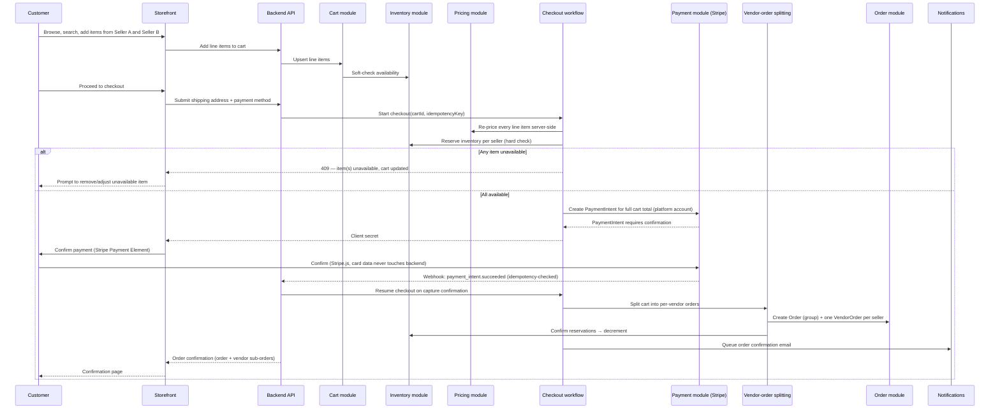
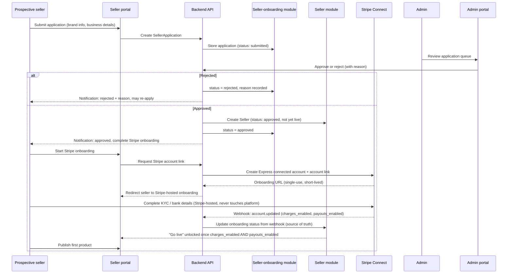
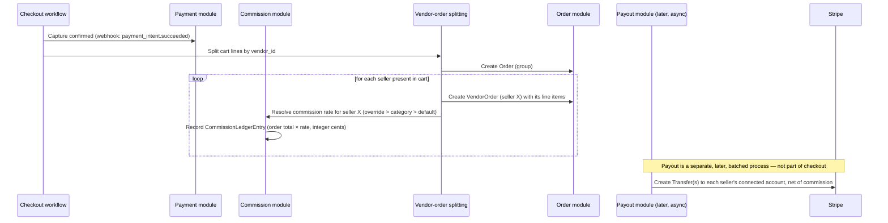
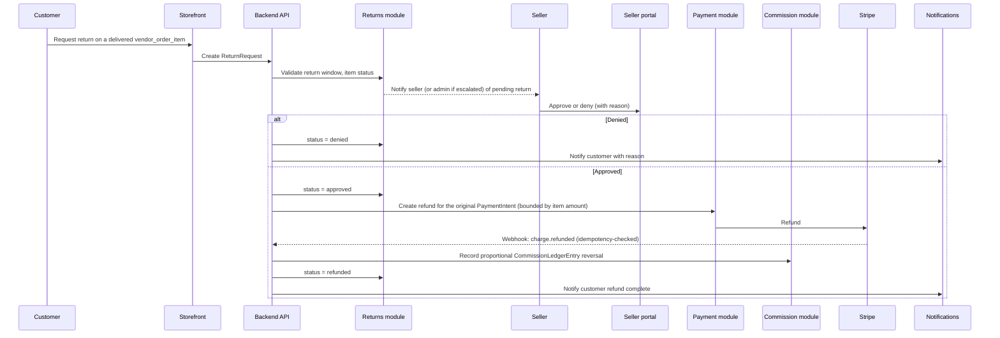

# Bawi Shopping — Marketplace Flows

This document walks the four flows that define the marketplace: customer purchase, seller onboarding, multi-vendor payment/order-splitting, and returns/refunds. Each includes a sequence diagram and the failure/edge cases the implementation must handle.

## 1. Customer purchase flow (multi-vendor cart → single checkout)

### Edge cases

- **Partial availability at submit time:** checkout fails atomically for the whole cart before any payment is created; the customer adjusts and resubmits. No partial charge is ever created.
- **Payment confirmation abandoned:** an uncaptured PaymentIntent expires; reserved inventory is released after a timeout so it isn't held indefinitely against an abandoned checkout.
- **Duplicate submission (double-click, network retry):** the checkout workflow is keyed by a client-generated idempotency key; a retried submission with the same key returns the existing result rather than creating a second order/charge.
- **Price changed since add-to-cart:** checkout always re-prices from the database; if the price moved, the customer is shown the new total before confirming payment (never silently charged a different amount than shown).
- **One seller in the cart is suspended between add-to-cart and checkout:** that seller's line items are blocked at the hard-availability-check step, same as an out-of-stock item.

## 2. Seller onboarding flow

### Edge cases

- **Seller closes the Stripe onboarding tab mid-flow:** they can resume; a new account link is generated (the old one is single-use/expired), and the platform never infers completion from client-side navigation — only from the `account.updated` webhook.
- **Stripe reports additional requirements later** (e.g., after a threshold is hit): the seller's "go live" status can flip back to blocked; this is handled the same way as initial onboarding — webhook-driven, not client-asserted.
- **Application resubmission after rejection:** allowed; a new `SellerApplication` links to the same prospective seller contact, previous rejection reason stays visible to admin reviewers.
- **Admin approves before Stripe details exist:** normal path — approval and Stripe onboarding are sequential, not simultaneous; a seller is `approved` (can access the portal, build a catalog in draft) before being `live` (can actually transact).

## 3. Multi-vendor payment and order-splitting flow

This is the mechanically hardest part of the platform: **one customer payment must fund N independent sellers, net of platform commission, without requiring the customer to pay N times.**

### Chosen pattern: Separate Charges and Transfers (Stripe Connect)

The platform's own Stripe account is the merchant of record for the single customer charge. After capture, the platform creates one Stripe **Transfer** per seller represented in the order, for that seller's net amount (their share of the order minus their commission), to their connected Express account. This is the standard Stripe Connect pattern for "one customer payment, multiple destination sellers," and it keeps the customer experience to a single payment while still giving each seller their own funds flow and Stripe dashboard.

Full mechanics, webhook idempotency, and failure handling are in [`PAYMENTS.md`](PAYMENTS.md). The order-splitting side:

Payout timing is deliberately decoupled from checkout: checkout only needs to authorize/capture the customer's single payment and record what each seller is owed (the commission ledger). Actually moving money to sellers happens on the payout schedule (see [`PAYMENTS.md`](PAYMENTS.md) §"Payout cadence"), which allows the platform to hold funds through the return window before paying out, reducing clawback risk.

### Edge cases

- **One seller's items are refunded after payout has already occurred for that order:** the commission reversal and any Transfer-reversal/offset against a future payout are handled explicitly — see [`PAYMENTS.md`](PAYMENTS.md) §"Refunds after payout."
- **A `VendorOrder` fails to create after capture succeeded** (should be effectively impossible given pre-capture reservation, but must be handled): the workflow retries the split step; if it cannot succeed, the event is surfaced to Admin as a manual-intervention case rather than silently losing the seller's portion of a captured payment.
- **Order contains only one seller:** the same code path runs (one `VendorOrder`, one commission entry) — there is no special-cased "single seller" shortcut, so behavior stays consistent as sellers are added or removed from a cart during checkout iteration.

## 4. Returns and refunds flow

### Edge cases

- **Return window expired:** request is rejected server-side at creation time with a clear message; window length is configurable (platform default, optionally overridden per seller/category — decision tracked in [`IMPLEMENTATION-PLAN.md`](IMPLEMENTATION-PLAN.md)).
- **Refund requested twice for the same item:** second request is rejected idempotently once a refund exists/is in-flight for that item.
- **Stripe refund fails** (e.g., insufficient available balance on the platform account): the return stays in an `approved-pending-refund` state, surfaced to Admin, rather than being marked `refunded` before Stripe confirms it.
- **Escalation:** if a seller doesn't act within an SLA window, Admin can approve/deny on the seller's behalf; this path is explicitly logged as an admin override in the audit log, distinct from a normal seller decision.
