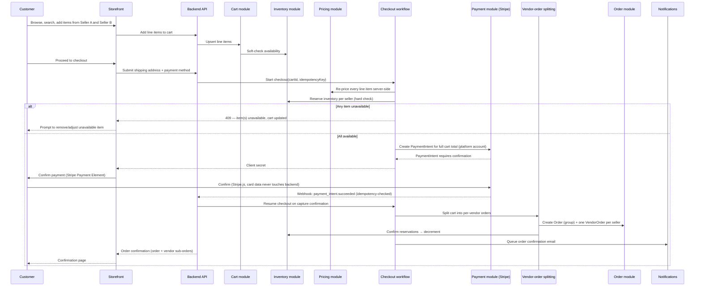
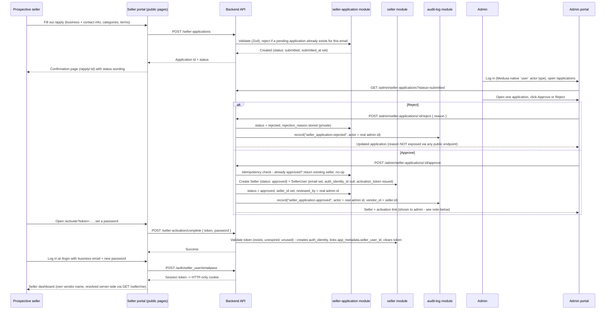
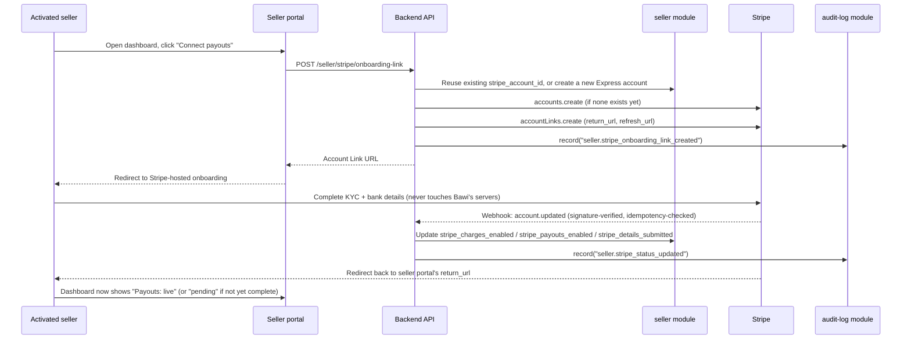
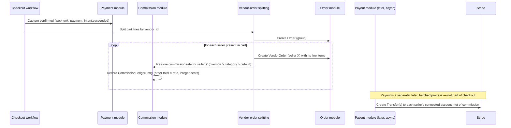
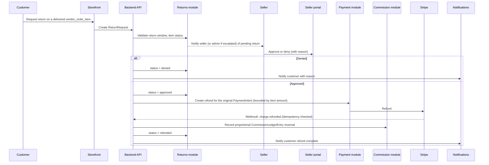

# Bawi Shopping — Marketplace Flows

This document walks the four flows that define the marketplace: customer purchase, seller onboarding, multi-vendor payment/order-splitting, and returns/refunds. Each includes a sequence diagram and the failure/edge cases the implementation must handle.

**Note on fulfillment/returns and identity separation:** the shipping and returns flows below predate the private-fulfillment decision in [`DECISIONS.md`](DECISIONS.md) and don't yet reflect it — they'll need a redesign pass once the fulfillment slice is actually built: separate temporary fulfillment/pickup/tracking codes per order (not one shared code), pickup codes single-use and expiring on collection, vendors seeing only product/size/quantity/prep-deadline/pickup-instructions per order, couriers scoped to their one assigned delivery, no direct seller↔customer shipping/tracking contact, and a pickup-location model that isn't hard-coded to "at the vendor's address" (must also support a future Bawi sorting hub — see `docs/ARCHITECTURE.md` §11). Until then, treat any step below that implies direct seller-to-customer shipping/tracking contact as provisional, not as contradicting the decided model.

## 1. Customer purchase flow (multi-vendor cart → single checkout)

**Cart and checkout are both implemented.** The diagram below is now the real end-to-end flow (`apps/backend/src/cart/`, `apps/backend/src/workflows/{start,capture,fail}-checkout*.ts`, custom `/store/cart/*` and `/store/checkout`/`/store/orders*` routes - see `docs/DECISIONS.md`). A few details worth calling out against the diagram as drawn: the availability check on add-to-cart is a **hard** rejection (quantity above live inventory or the configurable per-line-item maximum is refused outright), not the "soft-check" implied below; checkout's own re-validation at submit time reuses the exact same `resolveCartVariants()`/`refreshAndShapeCart()` re-resolution the cart already applies on every read, not a separate mechanism; an item that becomes unavailable *after* being added is never silently dropped from the cart - it stays, flagged, with `checkout_blocked: true` on the cart, until the customer resolves it; there is no guest checkout in v1 (`marketplace_order.customer_id` is `NOT NULL` by design - a guest must log in/register first, which already triggers the existing cart-merge flow); the "shipping-option selection" a customer sees is a single calculated flat-fee-or-free amount (no multi-carrier picker yet - no shipping_option module exists, see `docs/DECISIONS.md`); and vendor-order splitting only happens *after* payment capture succeeds, never before, so a seller's dashboard never shows an order that might not end up paid.

### Edge cases

- **Partial availability at submit time:** checkout fails atomically for the whole cart before any payment is created; the customer adjusts and resubmits. No partial charge is ever created.
- **Payment confirmation abandoned:** an uncaptured PaymentIntent expires; reserved inventory is released after a timeout so it isn't held indefinitely against an abandoned checkout.
- **Duplicate submission (double-click, network retry):** the checkout workflow is keyed by a client-generated idempotency key; a retried submission with the same key returns the existing result rather than creating a second order/charge.
- **Price changed since add-to-cart:** checkout always re-prices from the database; if the price moved, the customer is shown the new total before confirming payment (never silently charged a different amount than shown).
- **One seller in the cart is suspended between add-to-cart and checkout:** that seller's line items are blocked at the hard-availability-check step, same as an out-of-stock item.

## 2. Seller onboarding flow

**Implemented so far:** application submission → admin review → approval/rejection → seller account activation → seller login → Stripe Connect account linking (§2.2). An approved, activated seller can log in, build a catalog, and connect a Stripe Express account to become "live" for real transactions once test-mode Stripe is later graduated to live mode (see `docs/DECISIONS.md`).

### 2.1 Application, review, and activation (implemented)

**Note on the activation link:** there is no notification/email service yet (see `docs/PRD.md` §8 deferred features), so the approve action returns the activation link directly in the admin UI response for the admin to relay manually. This is a deliberate, documented stand-in — see `docs/DECISIONS.md` — not the intended production delivery mechanism (which will be an email once the Notifications module ships).

### Edge cases (implemented flow)

- **Duplicate submission:** a new application is rejected (409) if the same `business_email` already has a `submitted` or `under_review` application; resubmission after `rejected`/`withdrawn` is allowed (those are terminal, so no conflict).
- **Repeated approval (double-click, retry):** idempotent — the second call detects `seller_id` is already set and returns the existing seller/seller_user without creating duplicates or writing a second audit entry.
- **Invalid status transition:** approving a `rejected`/`withdrawn`/`draft` application (or rejecting an already-rejected one past the idempotent no-op case) is rejected with a 422, per the state machine in `apps/backend/src/modules/seller-application/state-machine.ts`.
- **Rejected or still-pending applicant tries to log into the seller portal:** fails with a generic "Invalid email or password" — there is no `seller_user`/`auth_identity` at all until an application is actually approved, so there's nothing to authenticate against (verified by an integration test and an E2E test).
- **Activation token reuse:** a second `POST /seller-activation/complete` with an already-consumed token is rejected (the token is cleared on first successful use).
- **Concurrent approval requests (residual risk):** the idempotency check has a narrow TOCTOU window under true concurrent requests (not just sequential retries) — see `docs/IMPLEMENTATION-PLAN.md` risks.

### 2.2 Stripe Connect account linking (implemented)

Layers on **after** activation: an activated seller can log in and manage a draft catalog, but isn't "live" for real transactions until Stripe onboarding completes. The seller-authenticated `POST /seller/stripe/onboarding-link` creates (or reuses) a Stripe Express account and returns a single-use, short-lived Account Link URL; the seller portal redirects there. `account.updated` webhooks (verified by Stripe signature, deduplicated via `processed_webhook_event`) are the onboarding-status source of truth — never inferred from client navigation or a "seller says they finished" claim. See `docs/PAYMENTS.md` §2, `docs/DECISIONS.md`.

## 3. Multi-vendor payment and order-splitting flow

This is the mechanically hardest part of the platform: **one customer payment must fund N independent sellers, net of platform commission, without requiring the customer to pay N times.**

### Chosen pattern: Separate Charges and Transfers (Stripe Connect)

The platform's own Stripe account is the merchant of record for the single customer charge. After capture, the platform creates one Stripe **Transfer** per seller represented in the order, for that seller's net amount (their share of the order minus their commission), to their connected Express account. This is the standard Stripe Connect pattern for "one customer payment, multiple destination sellers," and it keeps the customer experience to a single payment while still giving each seller their own funds flow and Stripe dashboard.

Full mechanics, webhook idempotency, and failure handling are in [`PAYMENTS.md`](PAYMENTS.md). The order-splitting side:

Payout timing is deliberately decoupled from checkout: checkout only needs to authorize/capture the customer's single payment and record what each seller is owed (the commission ledger). Actually moving money to sellers happens on the payout schedule (see [`PAYMENTS.md`](PAYMENTS.md) §"Payout cadence"), which allows the platform to hold funds through the return window before paying out, reducing clawback risk.

### Edge cases

- **One seller's items are refunded after payout has already occurred for that order:** the commission reversal and any Transfer-reversal/offset against a future payout are handled explicitly — see [`PAYMENTS.md`](PAYMENTS.md) §"Refunds after payout."
- **A `VendorOrder` fails to create after capture succeeded** (should be effectively impossible given pre-capture reservation, but must be handled): the workflow retries the split step; if it cannot succeed, the event is surfaced to Admin as a manual-intervention case rather than silently losing the seller's portion of a captured payment.
- **Order contains only one seller:** the same code path runs (one `VendorOrder`, one commission entry) — there is no special-cased "single seller" shortcut, so behavior stays consistent as sellers are added or removed from a cart during checkout iteration.

## 4. Returns and refunds flow

### Edge cases

- **Return window expired:** request is rejected server-side at creation time with a clear message; window length is configurable (platform default, optionally overridden per seller/category — decision tracked in [`IMPLEMENTATION-PLAN.md`](IMPLEMENTATION-PLAN.md)).
- **Refund requested twice for the same item:** second request is rejected idempotently once a refund exists/is in-flight for that item.
- **Stripe refund fails** (e.g., insufficient available balance on the platform account): the return stays in an `approved-pending-refund` state, surfaced to Admin, rather than being marked `refunded` before Stripe confirms it.
- **Escalation:** if a seller doesn't act within an SLA window, Admin can approve/deny on the seller's behalf; this path is explicitly logged as an admin override in the audit log, distinct from a normal seller decision.
